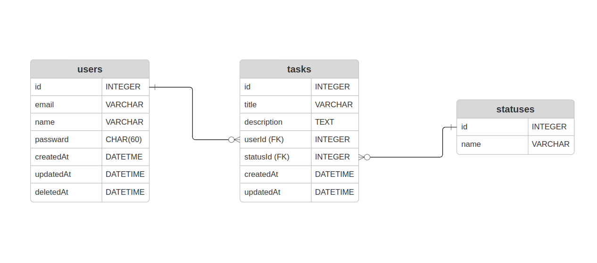
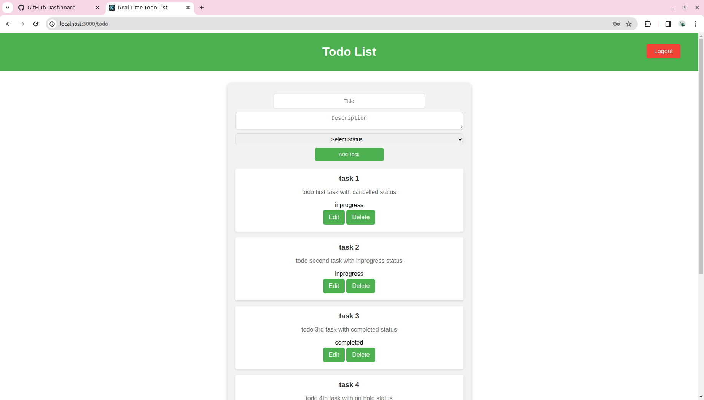

# Todo List
## - About Project
 A simple remote real-time Todo list using websocket connection to add, delete or update tasks instantaneously, supported for multiple users.
## - Database schema

## - Run Project
- backend:
1) Run <code>git clone https://github.com/alisayed987/real-time-todo-list.git </code>
2) create database
3) navigate to backend directory
4) Run <code> npm install </code>
5) create **.env** file from **.env.example** (modify credentials)
6) Run <code> npm run migrate </code>
7) [optional] Run  <code> npm run seed:all </code>
8) Run <code> npm start </code>

- frontend:
1) navigate to frontend directory 
2) Run <code> npm install </code> 
3) Run <code> npm start </code>
   
## - Screenshots
Todo List:

